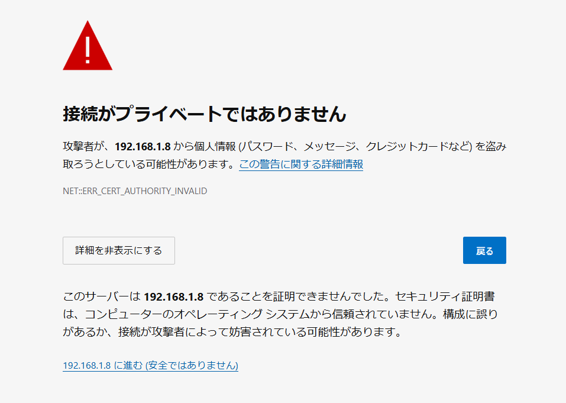

# Kashidasu 図書館管理システム


Kashidasuは、Webベースの図書館管理システムです。書籍の貸出・返却、管理、検索などの機能を提供し、バーコードスキャンによる効率的な運用をサポートします。

## 🚀 特徴

- **バーコード対応**: QuaggaJSを使用したバーコードスキャン機能
- **貸出期限管理**: 管理者は2週間、一般ユーザーは1週間の自動期限設定
- **一括登録**: CSVファイルとテキスト入力による効率的な書籍登録
- **レスポンシブデザイン**: モバイル・タブレット・デスクトップ対応
- **API認証**: APIキー認証とセッション認証の二重セキュリティ
- **HTTPS対応**: セキュアな通信環境

## 📋 目次

- [導入方法](#導入方法)
- [システム概要](#システム概要)
- [機能詳細](#機能詳細)
- [API仕様](#api仕様)
- [開発情報](#開発情報)
- [ライセンス](#ライセンス)

## 🛠 導入方法

### 必要要件

- **Node.js**: 22.x 以降
- **npm**: 9.x 以降
- **OS**: Windows, macOS, Linux

### 導入手順

1. **リポジトリのクローン**

   ```bash
   git clone https://github.com/yukki072417/Kashidasu.git
   cd Kashidasu
   ```

2. **サーバー証明書の発行**

   ```bash
   sh ./ca/init.sh
   ```

3. **依存パッケージのインストール**

   ```bash
   npm install
   ```

4. **環境変数の設定**

   ```bash
   # .env ファイルを作成
   BOOKS_API_KEY=your_api_key_here
   PORT=443
   ```

5. **サーバーの起動**
   ```bash
   npm start
   ```

## 🔑 初期認証情報

| 項目       | 値           |
| ---------- | ------------ |
| 管理者ID   | `0123456789` |
| パスワード | `password`   |

## 🌐 アクセス方法

### ローカルアクセス

```
https://localhost
```

### LAN内アクセス

1. サーバーPCのプライベートIPを確認：

   ```bash
   # Windows
   ipconfig

   # macOS/Linux
   ifconfig
   ```

2. ブラウザでアクセス：
   ```
   https://[プライベートIPアドレス]
   ```

## 📚 システム概要

### アーキテクチャ

- **バックエンド**: Node.js + Express.js
- **フロントエンド**: HTML5 + CSS3 + JavaScript (ES6+)
- **データストア**: JSONファイルベース
- **認証**: セッション認証 + APIキー認証
- **通信**: HTTPS

### ディレクトリ構成

```
Kashidasu/
├── src/                    # ソースコード
│   ├── app.js             # Expressアプリケーション
│   ├── controller/        # コントローラー層
│   ├── model/             # モデル層
│   ├── router/            # ルーティング層
│   ├── services/          # サービス層
│   ├── db/                # データベースモデル
│   ├── views/             # EJSテンプレート
│   └── public/            # 静的ファイル
├── repository/             # データストア
├── docs/                  # ドキュメント
└── ca/                    # 証明書ファイル
```

## ⚡ 機能詳細

### 📖 書籍管理

- **書籍登録**: 個別登録・一括登録（CSV/テキスト）
- **書籍検索**: タイトル・著者・ISBNでの検索
- **書籍編集**: 書籍情報の更新・削除
- **書籍一覧**: ページング・フィルター機能

### 📚 貸出管理

- **貸出処理**: バーコードスキャンによる貸出
- **返却処理**: バーコードスキャンによる返却
- **期限管理**: ユーザー種別による自動期限設定
- **貸出履歴**: 貸出・返却履歴の管理

### 👥 ユーザー管理

- **管理者認証**: セッションベースのログイン
- **利用者カード**: PDF形式の利用者カード生成
- **権限管理**: 管理者と一般ユーザーの権限分離

### 🔍 検索・表示

- **リアルタイム検索**: 書籍情報の即時検索
- **期限切れフィルター**: 期限切れ書籍の絞り込み
- **貸出状況表示**: 貸出日・期限日・返却日の表示

## 🔌 API仕様

### 共通レスポンス形式

```json
{
  "success": boolean,
  "message": string,
  "data": any
}
```

### 主要エンドポイント

| エンドポイント     | メソッド        | 説明                        |
| ------------------ | --------------- | --------------------------- |
| `/api/book/one`    | GET             | 書籍情報取得                |
| `/api/book/all`    | GET             | 全書籍一覧取得              |
| `/api/book`        | POST/PUT/DELETE | 書籍作成・更新・削除        |
| `/api/book/lend`   | POST            | 書籍貸出                    |
| `/api/book/return` | POST            | 書籍返却                    |
| `/api/book/loan`   | GET             | 貸出情報取得                |
| `/public/books`    | GET             | 公開書籍情報（APIキー認証） |

### 認証方式

- **セッション認証**: 管理API（`req.session.admin`）
- **APIキー認証**: 公開API（`X-API-Key` ヘッダー）

## 📊 データモデル

### 書籍データ (books.json)

```json
{
  "isbn": "string",
  "title": "string",
  "author": "string"
}
```

### 貸出データ (loan.json)

```json
{
  "loanId": "string",
  "bookId": "string",
  "userId": "string",
  "loanDate": "string",
  "returnDate": "string",
  "dueDate": "string"
}
```

### 管理者データ (admin.json)

```json
{
  "adminId": "string",
  "password": "string"
}
```

## 🎨 UI/UX

### デザイン特徴

- **レスポンシブデザイン**: あらゆるデバイスで最適表示
- **直感的な操作**: ドラッグ&ドロップ、バーコードスキャン
- **リアルタイムフィードバック**: 即時的な状態反映

### 表示形式

- **貸出期限**: `(貸出日) -> (返却期限日)`
- **状態表示**: 空き/貸出中/返却済み
- **期限切れ**: 赤色ハイライトでの警告表示

## 🔧 開発情報

### 開発環境

- **Node.js**: 22.x
- **Express**: 4.x
- **EJS**: 3.x
- **jQuery**: 3.7.1
- **QuaggaJS**: バーコードスキャン

### ビルド・デプロイ

```bash
# 開発モード
npm run dev

# 本番モード
npm start

# テスト実行
npm test
```

### ドキュメント

- [バックエンド仕様書](./backend.md)
- [フロントエンド仕様書](./frontend.md)
- [APIリファレンス](./api.md)

## 🐛 トラブルシューティング

### よくある問題

#### サーバーが起動しない

- Node.jsのバージョンを確認（22.x以降が必要）
- ポート443が他のプロセスで使用されていないか確認
- 証明書が正しく生成されているか確認

#### バーコードが読み取れない

- カメラの権限が許可されているか確認
- ブラウザがWebRTCをサポートしているか確認
- 十分な光量があるか確認

#### APIエラーが発生する

- 環境変数が正しく設定されているか確認
- HTTPSでアクセスしているか確認
- ネットワーク接続を確認

### ログの確認

```bash
# アプリケーションログ
tail -f logs/app.log

# エラーログ
tail -f logs/error.log
```

## 🤝 貢献方法

1. フォークする
2. 機能ブランチを作成 (`git checkout -b feature/AmazingFeature`)
3. コミットする (`git commit -m 'Add some AmazingFeature'`)
4. プッシュする (`git push origin feature/AmazingFeature`)
5. プルリクエストを作成する

## 📝 更新履歴

### v1.3.0 (2026-03-09)

- ✨ 貸出期限の自動設定機能
- ✨ 一括登録機能の改善（上書き/追加モード）
- ✨ Fetch APIへの移行
- 🐛 APIレスポンス形式の統一
- 🐛 貸出期限表示の修正

### v1.2.0

- ✨ バーコードスキャン機能
- ✨ 利用者カード生成機能
- ✨ APIキー認証機能

### v1.1.0

- ✨ 書籍管理機能
- ✨ 貸出・返却機能
- ✨ 検索機能

### v1.0.0

- 🎉 初版リリース

## 📄 ライセンス

このプロジェクトはMITライセンスの下でライセンスされています。詳細は[LICENSE](LICENSE)ファイルを参照してください。

## 📞 お問い合わせ

- **プロジェクト管理者**: yukki072417
- **GitHub**: https://github.com/yukki072417/Kashidasu
- **Issues**: https://github.com/yukki072417/Kashidasu/issues

---

⭐ このプロジェクトが役立った場合は、スターを付けてください！

そうすると、このような出力がされると思います（windowsの場合）

    Windows IP 構成
    （略）
    IPv4 アドレス . . . . . . . . . . . .: XXX.XXX.XXX.XXX <-これがIPv4のIPアドレス
    （略）

IPv4の値がIPv4のアドレスです。こちらをアクセス元のPCのブラウザにあるURL入力欄に
以下を入力してください

    https://<IPv4のIPアドレス>

また、MacOS, Linuxの場合も基本的なやり方は同じです。私はwindows信者なので、READMEでの説明はwindows以外省略します。
また、Android, iOSなどのスマホ・iPadなどのスマートフォンでは対応していません。そのうち対応させます。

## 補足情報

ブラウザでアクセスすると、**「接続がプライベートではありません」** のような表示がされますが、ローカル（LAN内）のネットワークで動かす場合は、構造上の都合上表示されているだけで、動作に影響はありません。

「詳細設定」をクリックし「...に進む(安全ではありません)」をクリックして、Kashidasuにアクセスしてください


## 利用OSSライブラリとライセンス

本ソフトウェアは以下のOSSライブラリを利用しています。  
各ライブラリの著作権表示およびライセンス条項は、それぞれのリポジトリまたはnpmパッケージに従います。

- @pdf-lib/fontkit (MIT License)
- canvas (MIT License)
- dotenv (MIT License)
- ejs (Apache-2.0 License)
- express (MIT License)
- express-session (MIT License)
- jsbarcode (MIT License)
- log4js (Apache-2.0 License)
- mysql2 (MIT License)
- pdf-lib (MIT License)
- pdf-poppler (MIT License)
- pdf2pic (MIT License)
- ほか package.json 記載の各ライブラリ

詳細は node_modules ディレクトリ内の各ライブラリの LICENSE ファイルをご参照ください。

## 著作権

ベータ版Kashidasu（Kashidasu-beta）は、著作権法に基づき著作権が保護されます。また、本アプリの利用・再配布はMIT License（MITライセンス）の条件に従います。

## 📈 運用実績と改善

**リリース後の改善:**

- beta-v1.0.0: 初回リリース
- beta-v1.1.0: バーコードリーダーでの読み取り機能を実装
- beta-v1.2.0: CSVによる一括登録機能追加
- v1.3.0: 正式版リリース

#### ゆっきー

Webサイト: https://yukki-room.pages.dev/
メールアドレス: yukki072417@gmail.com<br>
