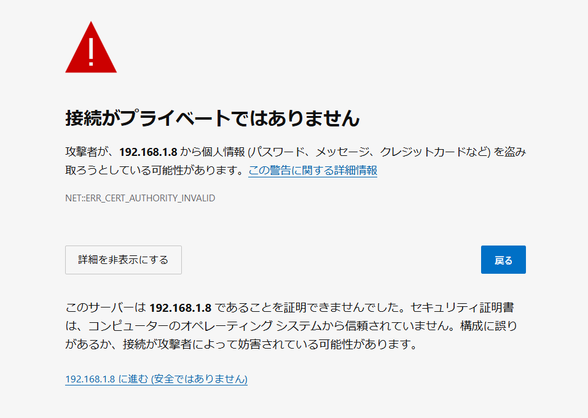

## 導入方法

### 必要要件

- Node22 のランタイムが入っていること

### 導入

Githubからリポジトリをクローン

    git clone https://github.com/yukki072417/Kashidasu.git

Kashidasuのディレクトリに移動

    cd Kashidasu

### サーバーの立ち上げ方

`npm run start` をターミナルなどで実行すればサーバーが立ち上がります

## ブラウザでのアクセス方法

### 自分でサーバーを立ち上げている場合

自分からPCアクセスするには、ブラウザのURL入力欄に以下のアドレスを入力してください

    https://localhost

### 他のPC・（LAN内に存在する）サーバーで立ち上げている場合

他のPCにアクセスするには、サーバーを立ち上げたプライベートipアドレスを知る必要があります。サーバーを立ち上げたPCでこちらのコマンドを入力してください

    ipconfig

そうすると、このような出力がされると思います（windowsの場合）

    Windows IP 構成
    （略）
    IPv4 アドレス . . . . . . . . . . . .: XXX.XXX.XXX.XXX <-これがIPv4のIPアドレス
    （略）

IPv4の値がIPv4のアドレスです。こちらをアクセス元のPCのブラウザにあるURL入力欄に
以下を入力してください

    https://<IPv4のIPアドレス>

また、MacOS, Linuxの場合も基本的なやり方は同じです。私はwindows信者なので、READMEでの説明はwindows以外省略します。

また、Android, iOSなどのスマホ・iPadなどのスマートフォンでは対応していません。そのうち対応させます。

#### (例)

    ROOT_PASSWORD=fjeA23jIod30
    TIME_ZONE=Asia/Tokyo

1. ROOT_PASSWORDは不規則で、英字や数字などを含んだ推測されにくい12文字以上のパスワードを使用することを**強く推奨します**。
2. TIME_ZONEはあなたが日本でお住まいである限り、例の通り記述してもらって構いません

## 補足情報

ブラウザでアクセスすると、**「接続がプライベートではありません」** のような表示がされますが、ローカル（LAN内）のネットワークで動かす場合は、構造上の都合上表示されているだけで、動作に影響はありません。

「詳細設定」をクリックし「...に進む(安全ではありません)」をクリックして、Kashidasuにアクセスしてください

## 利用OSSライブラリとライセンス

本ソフトウェアは以下のOSSライブラリを利用しています。  
各ライブラリの著作権表示およびライセンス条項は、それぞれのリポジトリまたはnpmパッケージに従います。

- @pdf-lib/fontkit (MIT License)
- canvas (MIT License)
- dotenv (MIT License)
- ejs (Apache-2.0 License)
- express (MIT License)
- express-session (MIT License)
- jsbarcode (MIT License)
- log4js (Apache-2.0 License)
- mysql2 (MIT License)
- pdf-lib (MIT License)
- pdf-poppler (MIT License)
- pdf2pic (MIT License)
- ほか package.json 記載の各ライブラリ

詳細は node_modules ディレクトリ内の各ライブラリの LICENSE ファイルをご参照ください。

## 著作権

ベータ版Kashidasu（Kashidasu-beta）は、著作権法に基づき著作権が保護されます。また、本アプリの利用・再配布はMIT License（MITライセンス）の条件に従います。

## 開発者

#### ゆっきー

メールアドレス: yukki072417@gmail.com 
